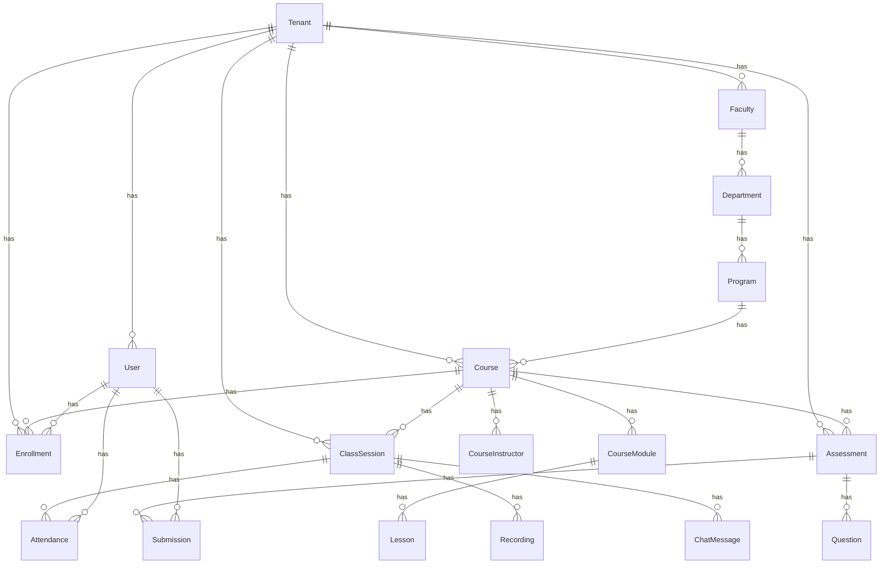

# Data Dictionary

## Overview

The AI-Native University platform uses PostgreSQL 16 with Prisma ORM. All entities use UUID primary keys and support multi-tenancy via `tenantId` foreign keys.

Schema: `apps/api/prisma/schema.prisma` (21 models)

---

## Entity Relationship Diagram

---

## Models

### Tenant (tenants)
| Column | Type | Required | Default | Description |
|--------|------|----------|---------|-------------|
| id | UUID | ✅ | auto | Primary key |
| name | String | ✅ | — | Organization name |
| slug | String | ✅ | — | Unique URL slug |
| domain | String | — | null | Custom domain |
| plan | String | ✅ | "free" | Subscription plan |
| locale | String | ✅ | "fa" | Default locale |
| aiPolicy | JSON | — | null | AI usage policy |
| status | String | ✅ | "active" | active/suspended/trial |

### User (users)
| Column | Type | Required | Default | Description |
|--------|------|----------|---------|-------------|
| id | UUID | ✅ | auto | Primary key |
| tenantId | UUID | ✅ | — | FK → Tenant |
| email | String | ✅ | — | User email (unique per tenant) |
| passwordHash | String | ✅ | — | Bcrypt hash |
| fullName | String | ✅ | — | Display name |
| phone | String | — | null | Phone number |
| role | String | ✅ | "student" | super_admin/admin/instructor/student/teaching_assistant |
| locale | String | ✅ | "fa" | Preferred locale |
| isActive | Boolean | ✅ | true | Account active flag |
| lastLoginAt | DateTime | — | null | Last login timestamp |

### AuditLog (audit_logs)
| Column | Type | Required | Default | Description |
|--------|------|----------|---------|-------------|
| id | UUID | ✅ | auto | Primary key |
| tenantId | String | ✅ | — | Tenant scope |
| userId | String | — | null | Acting user |
| action | String | ✅ | — | Action performed |
| entity | String | ✅ | — | Entity type |
| entityId | String | — | null | Entity ID |
| metadata | JSON | — | null | Additional context |

### Faculty (faculties)
| Column | Type | Required | Default | Description |
|--------|------|----------|---------|-------------|
| id | UUID | ✅ | auto | Primary key |
| tenantId | UUID | ✅ | — | FK → Tenant |
| name | String | ✅ | — | Faculty name |
| slug | String | ✅ | — | URL slug |
| description | String | — | null | Description |

### Department (departments)
| Column | Type | Required | Default | Description |
|--------|------|----------|---------|-------------|
| id | UUID | ✅ | auto | Primary key |
| facultyId | UUID | ✅ | — | FK → Faculty |
| name | String | ✅ | — | Department name |
| slug | String | ✅ | — | URL slug |

### Program (programs)
| Column | Type | Required | Default | Description |
|--------|------|----------|---------|-------------|
| id | UUID | ✅ | auto | Primary key |
| departmentId | UUID | ✅ | — | FK → Department |
| name | String | ✅ | — | Program name |
| slug | String | ✅ | — | URL slug |
| degree | String | ✅ | "bachelor" | bachelor/master/phd |
| totalCredits | Int | ✅ | 140 | Required credits |

### Course (courses)
| Column | Type | Required | Default | Description |
|--------|------|----------|---------|-------------|
| id | UUID | ✅ | auto | Primary key |
| tenantId | UUID | ✅ | — | FK → Tenant |
| programId | UUID | — | null | FK → Program |
| title | String | ✅ | — | Course title |
| slug | String | ✅ | — | URL slug (unique) |
| description | String | — | null | Description |
| level | String | ✅ | "beginner" | beginner/intermediate/advanced |
| language | String | ✅ | "fa" | Content language |
| credits | Int | ✅ | 3 | Credit hours |
| maxEnrollment | Int | — | null | Enrollment cap |
| status | String | ✅ | "draft" | draft/published/archived |
| version | Int | ✅ | 1 | Course version |

### CourseInstructor (course_instructors)
| Column | Type | Description |
|--------|------|-------------|
| id | UUID | Primary key |
| courseId | UUID | FK → Course |
| userId | UUID | FK → User (instructor) |
| role | String | "primary" or "assistant" |

### CourseModule (course_modules)
| Column | Type | Description |
|--------|------|-------------|
| id | UUID | Primary key |
| courseId | UUID | FK → Course |
| title | String | Module title |
| slug | String | URL slug |
| description | String | Description |
| sortOrder | Int | Display order |

### Lesson (lessons)
| Column | Type | Description |
|--------|------|-------------|
| id | UUID | Primary key |
| moduleId | UUID | FK → CourseModule |
| title | String | Lesson title |
| slug | String | URL slug |
| contentType | String | text/video/interactive |
| contentUrl | String | Content file URL |
| durationMin | Int | Duration in minutes |
| isPublished | Boolean | Published flag |
| sortOrder | Int | Display order |

### Enrollment (enrollments)
| Column | Type | Description |
|--------|------|-------------|
| id | UUID | Primary key |
| tenantId | UUID | FK → Tenant |
| userId | UUID | FK → User |
| courseId | UUID | FK → Course |
| status | String | active/completed/dropped/suspended |
| progress | Float | 0-100 completion percentage |
| enrolledAt | DateTime | Enrollment timestamp |
| completedAt | DateTime | Completion timestamp |

### ClassSession (class_sessions)
| Column | Type | Description |
|--------|------|-------------|
| id | UUID | Primary key |
| tenantId | UUID | FK → Tenant |
| courseId | UUID | FK → Course |
| title | String | Session title |
| description | String | Session description |
| scheduledAt | DateTime | Start time |
| endedAt | DateTime | End time |
| status | String | scheduled/live/ended/cancelled |
| meetingUrl | String | Video call URL |

### Attendance (attendances)
| Column | Type | Description |
|--------|------|-------------|
| id | UUID | Primary key |
| sessionId | UUID | FK → ClassSession |
| userId | UUID | FK → User |
| joinedAt | DateTime | Join timestamp |
| leftAt | DateTime | Leave timestamp |
| durationMin | Int | Calculated attendance duration |

### ChatMessage (chat_messages)
| Column | Type | Description |
|--------|------|-------------|
| id | UUID | Primary key |
| sessionId | UUID | FK → ClassSession |
| userId | UUID | FK → User |
| content | String | Message text |

### Recording (recordings)
| Column | Type | Description |
|--------|------|-------------|
| id | UUID | Primary key |
| sessionId | UUID | FK → ClassSession |
| url | String | Recording file URL |
| durationMin | Int | Recording duration |
| sizeBytes | BigInt | File size |
| format | String | File format (mp4, webm) |

### Assessment (assessments)
| Column | Type | Description |
|--------|------|-------------|
| id | UUID | Primary key |
| tenantId | UUID | FK → Tenant |
| courseId | UUID | FK → Course |
| title | String | Assessment title |
| type | String | quiz/assignment/exam/project |
| dueDate | DateTime | Submission deadline |
| maxScore | Float | Maximum points |
| passingScore | Float | Minimum passing score |
| status | String | draft/published/closed |
| aiGradingEnabled | Boolean | Auto-grading enabled |

### Question (questions)
| Column | Type | Description |
|--------|------|-------------|
| id | UUID | Primary key |
| assessmentId | UUID | FK → Assessment |
| text | String | Question text |
| type | String | multiple_choice/true_false/short_answer/essay |
| options | JSON | Answer options (for MCQ) |
| correctAnswer | String | Correct answer |
| points | Float | Question points |
| sortOrder | Int | Display order |

### Submission (submissions)
| Column | Type | Description |
|--------|------|-------------|
| id | UUID | Primary key |
| assessmentId | UUID | FK → Assessment |
| userId | UUID | FK → User |
| answers | JSON | Student answers |
| score | Float | Calculated score |
| feedback | String | Grading feedback |
| status | String | submitted/graded/returned |
| submittedAt | DateTime | Submission timestamp |
| gradedAt | DateTime | Grading timestamp |
| gradedBy | String | Grader user ID |

### Certificate (certificates)
| Column | Type | Description |
|--------|------|-------------|
| id | UUID | Primary key |
| tenantId | UUID | FK → Tenant |
| userId | UUID | FK → User |
| courseId | UUID | FK → Course |
| certificateUrl | String | PDF/image URL |
| issuedAt | DateTime | Issue date |

### LearningEvent (learning_events)
| Column | Type | Description |
|--------|------|-------------|
| id | UUID | Primary key |
| tenantId | UUID | FK → Tenant |
| actorId | UUID | FK → User |
| eventType | String | lesson_viewed/quiz_completed/etc. |
| resourceType | String | lesson/assessment/course |
| resourceId | String | Resource entity ID |
| metadata | JSON | Event-specific data |
| confidence | Float | AI confidence score |

### AiInteractionLog (ai_interaction_logs)
| Column | Type | Description |
|--------|------|-------------|
| id | UUID | Primary key |
| tenantId | UUID | FK → Tenant |
| userId | UUID | FK → User |
| correlationId | String | Request correlation ID |
| interactionType | String | rag_query/class_summary/grade/risk |
| inputSummary | String | Input summary |
| outputSummary | String | Output summary |
| model | String | AI model used |
| provider | String | AI provider |
| latencyMs | Int | Response time in ms |
| humanReviewRequired | Boolean | Requires human review |

---

## Indexes

- `User`: unique compound index on `(tenantId, email)`
- `Enrollment`: unique compound index on `(userId, courseId)`
- `Course.slug`: unique global
- `Tenant.slug`: unique global
- `Attendance`: unique compound on `(sessionId, userId)`

## Multi-Tenancy

All tenant-scoped queries filter by `tenantId`. The `super_admin` role bypasses tenant checks.
